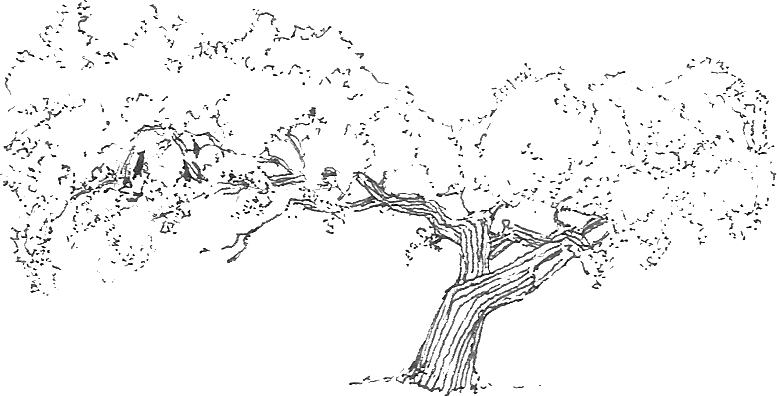

## un espacio propio en internet

como un taller de intentos      
descubrimiento de herramientas sin cuerpo       
interacción de sensaciones y una infinidad      
##
la extensión del mundo que más recorremos
##
salas y muros luminosos         
unos pocos para el universo de todos nosotros           
vemos todos todos lo mismo al mismo tiempo          
¿qué formas le da a nuestra imaginación una imagen repetida?            
¿qué nuevas formas de interacción aprendemos de una misma fuente fija?      

## qué puede haber en internet

saber recorrer no implica saber trazar      
qué tanto se desconoce lo que se ve     
por qué cada forma fuente sonido luminosidad y por qué se homogeniza
##
qué forma tendría mi espacio