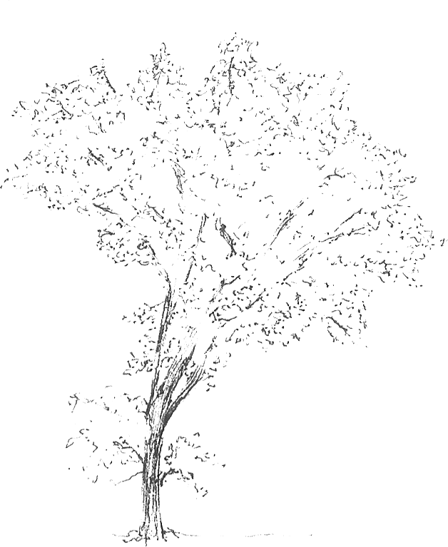

## repertorio de piano para adultos principiantes
¿Qué debe tener el repertorio de adultos principiantes para ser interesante y provechoso?       
##
## aprendí como adulto

Empecé a aprender a tocar piano con 18 años. Antes había estudiado parte de la base de la teoría musical, entre la orquesta juvenil de puente alto y mis estudios autodidactas. Si bien ya tocaba algo de piano antes, lo hacía sin referencias técnicas ni interpretativas, solo trasladando lo que sabía hacia el piano, y siempre me sentí muy desestructurado, con una deuda constante con las bases.               
##

A los 18 fue mi primera experiencia de clases formales(1), en una escuela con profesores acostumbrados a formar niños. Lo bonito es que en ese tiempo también estudiamos algo que llamaban literatura musical, como una mezcla entre apreciación, análisis e historia musical. Durante las ventanas entre clases, y en parte para salvarme del temor a socializar con mis compañeros, iba al archivo de la escuela a volver a escuchar esa música, idealizando el convertirme en un erudito musical como mis profesores, pero olvidando inmediatamente autores, fechas y estilos, opacados todos por mi necesidad de repetir sin parar pasajes específicos de músicas específicas.              
##
En clases de literatura musical veíamos la forma de una fuga, de un minueto, de un rondó, de una sonata, con ejemplos magistrales. En clases de piano estudiamos repertorios con minuetos fáciles, sonatas breves y composiciones con nombres de asociación inmediata con la infancia o sensaciones fáciles de asimilar, como “marcha”, “paseo”, “amigos riendo”, “volantín”. Siempre sentí distancia con esa música de aprendizaje, me parecían reducciones de piezas reales, obras vueltas sencillas por medio de ejercicios de recorte que no compensaban la pérdida de musicalidad. Mi situación era la de un aprendiz con nula o escasa habilidad pianística, pero con mi propia historia musical, mi cultura ya medianamente bien asimilada, como el común de los adultos, mis preferencias y aspiraciones musicales. Había una distancia entre lo que era capaz de interpretar y cómo quería que sonara, y para soportarlo forzaba mi interés por estas piezas iniciales. 
##

## aprender a leer
Recuerdo la primera vez que di la PSU. En el cuadernillo de la prueba de lenguaje venía el extracto de un texto para analizar, que hablaba sobre el desafío de buscar literatura interesante para adultos que estaban aprendiendo a leer. La gran mayoría del material de aprendizaje de lectura está enfocado en conmover a los niños, en que su capacidad lectora crezca a la par de su mundo emocional y universo de referencias. Un adulto ha acumulado un compendio considerable de historias, opiniones, dramas, arrepentimientos, teorías del mundo.         
¿Cómo se explica la etapa de crecimiento adulta?        
¿o cómo se define la adultez en función del tiempo vivido y la experiencia?         
Un adulto - supongo - ya ha logrado, si no nombrar, al menos reconocer las emociones pequeñas entre emociones, los matices dentro de la paleta y su variedad de intensidades. O si no las ha reconocido, las habrá vivido de alguna manera, y las conservará como una huella escondida o como una sensación pendiente, como una culpa. ¿Cómo se logra que el material de estudio y las lecturas para adultos que aprenden a leer sea asimilable e interesante a la vez? o sea, que exprese complejidad sin ser técnicamente complicado. Que la habilidad de leer les traiga dicha y provecho.
##
Volviendo al piano, desconfío de la manera de construir un repertorio para principiantes adultos, que en el fondo era mi problema inicial, por medio de crear adaptaciones fáciles de canciones populares. O al menos no sin hacer el ejercicio de entender la canción y conservar lo que se descubra en ella como valioso.
##

## la música de la infancia
Últimamente le he tomado cariño a piezas para piano que logran ser sencillas y profundas, que al escucharlas llega un momento en que siento un “ah claro!”, como si hubiesen logrado nombrar una emoción. O crear una emoción y volverse su forma de nombrarla. Y no siendo sencillas por proponérselo, sino, creo, como resultado de una atención y cuidado al componerla, liberado, creo, de la presuposición de la forma que tiene que tener una pieza de piano. 
##
También he descubierto el respeto que expresan algunos compositores por la profundidad de las emociones infantiles, sobre todo cierta melancolía infantil, una sensación de desequilibrio, o de mirar cosas pequeñas. Hoy escuché por primera vez “A Prole do Bebê” (algo como “la familia del bebé”) de Heitor Villa-Lobos, una serie de canciones divididas en dos grupos, uno de canciones para las muñecas y otro para los animalitos, y en la de los animalitos hay una para un gatito de cartón y otra para un perro de goma, ambas trágicas, o no trágicas, pero dudan. 
##
¿Para quién es la música que piensa en la infancia? 
Aunque la música puede hablar prácticamente de todo (como quien crea la canción de una montaña, o del movimiento de una trucha, a ese todo me refiero), creo que hay algo particular con la que toca las escenas de la infancia. Como si desvelara parte de una sensación profunda y desbordante que quiere ser nombrada.
##
Cierro declarando que estoy siendo injusto con la música con la que aprendí. Con el tiempo  he ido descubriendo lo linda que es.
También me queda pendiente escribir sobre el miedo a aprender música siendo adultos.
##

## notas
1. Ahora me pregunto también si hago mal en no considerar el paso por una orquesta juvenil como un estudio formal.
##

## músicas que llevo hasta ahora:
- Heitor Villa-Lobos: A Prole do Bebê
- Aram Kachaturian: Álbum para Niños (volúmenes I y II)
- Debussy: Children’s Corner
- Mompou: Impresiones Íntimas (que no es infantil, pero lo es)
- Viktor Kosenko: 24 Piezas para Niños Op. 25
- Samuel Maykapar: 12 Hojas de Álbum para la Juventud Op. 16 (creo que así se traduce)
- Las colecciones de miniaturas de jazz de Norton, Mordasov y otros varios más